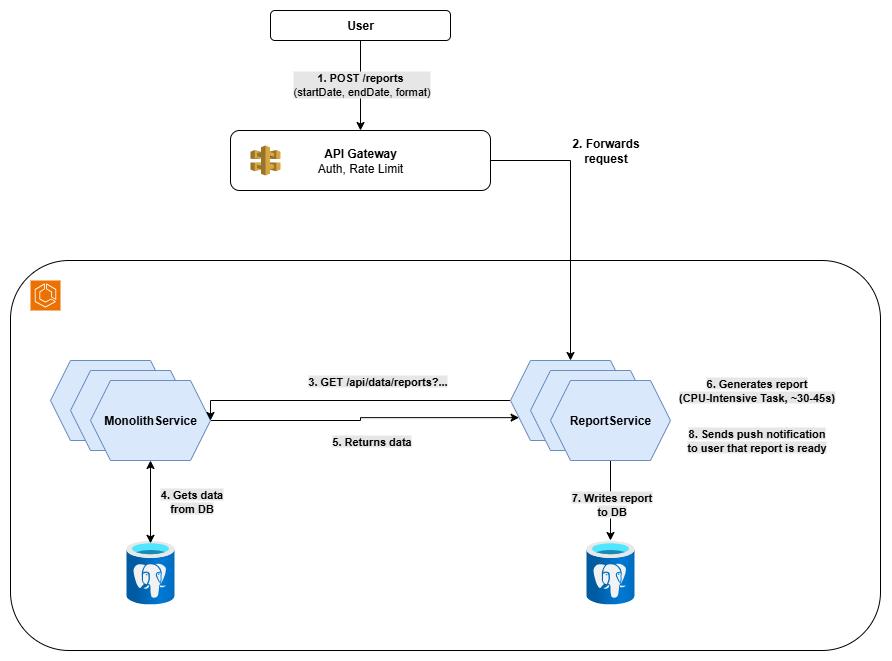

# Real Consulting Example: Refactoring FinTech Project to use Terraform and ArgoCD

This is a FinTech project from my consulting career as a software architect. It involves refactoring a project to use Infrastructure as Code (IaC) and making certain infrastructure decisions/tradeoffs. You're very welcome to share your thoughts and whether you agree with our design decisions!

## Project

Our client was running a SaaS Multi-Tenant Platform on AWS. It was an early beta and had about 30 tenants and was basically a platform for tracking B2B expenditures, generating reports, forecasts and such stuff. The client had three problems:

1. The infrastructure was poorly documented and either set up using the AWS web UI or the AWS CLI,
2. The platform was not scaling well enough, it struggled with peek loads (became slow or even unavailable),
3. The platform was not yet fully compliant with regulations and company standards.

Just a super quick simplified reminder of what multi-tenant means: the app has more than one customer (tenant) and all tenants share the same infrastructure and application, but each tenant's data is **isolated** and **secure** from others.

### Problem 1

As you can guess, this lead to major problems for the client. Manually setting up 30 infrastructures is time-intense (and thus expensive) and error prone. Especially when the existing documentation is a poorly maintained confluence page. The solution to this is IaC and ideally continuous delivery of that infrastructure. This is what the client wanted us to implement. We conviced him that using ArgoCD would be great as well, so that drift is reconciled and the project is _"full GitOps"_. I added a quick reminder of what that means later.

The decisions left for us to make were:

- CloudFormation (CF), AWS CDK or Terraform (TF)?
- Separate repo for IaC or put it in the backend repo?

### Problem 2

The backend was a monolithic spring boot app running on ECS (Elastic Container Service) with Fargate. When multiple tenants took to the platform and started generating reports and forecasts, it became slow and at sometimes even completely stopped responding. The reason was high CPU usage and shared DB resources.

The client used a pool model as opposed to a silo model. Pool model means that they use, for example, one DB in the same VPC (Virtual Private Cloud) for all tenants, but isolate the data in there. That could be via having different tables for different tenants. The silo model, on the other hand, is having isolated resources. This could be having separate Amazon RDS instances for each customer, or even to have separate VPCs per tenant with NAT gateways and more.

### Problem 3

More about that later.

## Our Solution

### IaC Solution

First question, are we going to use CF, CDK or TF? This was a pretty simple decision. All of them are maintained well and have strong community support, so we went with Terraform for the simple reason that the client's dev team was more familiar with TF. Many of their developers came from Azure or GCP backgrounds, so they didn't know CF or AWS CDK at all.

The second decision was whether to put the IaC in a separate repo or include it in the backend repo. We suggested a separate repository for the infrastructure code. This was because of clearer access control (who can access which repo, they're a big corporate, so access control topics may take some time there...) and because if they want to split up the monolith in the future, you would need a separate repo anyway. However, both approaches work well, and this advantage isn't massive. We discussed it with the client and they also preferred the separation of repos.

The most time-consuming part was importing the existing infrastructure into Terraform. We decided to manually import the existing AWS infrastructure into Terraform. For each service type, we listed the existing services (via AWS CLI or sometimes web console), and for each result we created an empty resource, like so:

```hcl
resource "aws_s3_bucket" "mybucket" {
}
```

Then we did `terraform import aws_s3_bucket.mybucket real-bucket-name`. Then we looked at the imported configs via `terraform show` and pasted the corresponding config into the created empty config. And this for each listing, for each service. This took a long time and we had to still do a "clean up" afterwards. We spent almost 2-3 weeks just going through all the resources and fixing issues we discovered along the way.

Once we had everything in Terraform, we set up ArgoCD for GitOps. For those not familiar, what I mentioned earlier, _"drift"_ is when your actual infrastructure differs from what's defined in your Terraform code. Maybe someone made a manual change in the AWS console, or a resource got modified outside of your IaC pipeline. ArgoCD tackles this by continuously monitoring your Git repository (the single source of truth) and automatically reconciling any differences it finds in your actual infrastructure. This _"self-healing"_ capability means that if someone manually changes something, ArgoCD will detect it and revert it back to match what's defined in Git.

So in simpler words, ArgoCD always checks whether your Kubernetes matches your Git. If not, it updates the Kubernetes to match your Git. This way, Git always is your single source of truth - which is exactly what GitOps is.

### Scalibility Solution

A first thought was to split the monolith. This would make sense since report generation has very different scaling and infrastructure different needs than the dashboard for example. That said, a full migration to microservices wasn't feasible within the scope or budget of this project. Instead we only split out the reporting service as that was the source of our performance issues. However, scaling the remaining monolith and the DBs is still important since both remain bottlenecks.

## Our Implementation Overview

### Vertical and Horizontal Scaling

First, we did some simple vertical scaling. We bumped up the ECS task definitions to use larger Fargate instances (from 1 vCPU/2GB RAM to 2 vCPU/4GB RAM per task). The main database (PostgreSQL RDS) also got a boost from db.t3.medium to db.r5.large to handle the increased load better.

For horizontal scaling, we improved the system by increasing the number of ECS tasks it can scale up to. Now, the service can automatically grow from 2 up to 8 tasks based on CPU usage and request load, allowing it to better handle traffic spikes.

### Strategic Service Extraction

The big architectural change was extracting the report generation functionality into a standalone service. This made perfect sense because report generation is CPU-intensive, has different scaling requirements, and was what was killing the application's performance.

The report service remained a Spring Boot application (no point in changing the tech stack the team knows well), but now it runs as its own ECS service with dedicated resources. Since the remaining monolith never needed to inititiate to generate a report, the only service-to-service communication we needed was report service to _"monolith-service"_. That communication is needed for the report service to retrieve the data it needs for generating a report.

Since the main issue was CPU usage and not DB throughput or something like that, we decided to use the simplest solution here: a simple REST API that the report service uses to request the data from the monolith-service.

Alternatives would have been using a message queue, writing the needed data to both services instead of just to the monolith service, and others. They come with tradeoffs of course. Another thing one could consider here in the future is using CQRS at the monolith service. This would allow for faster reads and we could optimize the read DB for high through put. However, that would only make sense when you run into scalibility issues there or you need very fast reads so we did not do it and kept it simple.

#### Report Flow

The user requests a report:

```json
POST /reports
Content-Type: application/json

{
  "startDate": "2024-01-01",
  "endDate": "2024-12-31",
  "format": "pdf"
}
```

which is received by the API gateway. This checks authentication and rate limiting, and then forwards the request to the report service.

The report service processes the request and calls the monolith service to fetch the necessary data: `jsonGET /api/data/reports?startDate=2024-01-01&endDate=2024-12-31`

Once the data is retrieved, the report service generates the report writes it to its Postgres DB (it then also sends a push notification but more on this later). The entire flow typically takes 30-45 seconds for large reports, but now runs without impacting the main application's performance.



### Database Strategy

For the report service database, we chose PostgreSQL again, but a separate RDS instance optimized for read-heavy workloads: db.r5.xlarge with read replicas. We considered DynamoDB since reports could be stored as JSON documents, but the client's team was much more comfortable with SQL, and they needed complex queries for their business intelligence features.

### Quick and Dirty Push Notifications

The report service handles its own push notifications when reports are complete. Yeah, ideally we'd have a dedicated notification service that the entire platform could use, but that wasn't in the budget. We implemented a simple solution using AWS SNS for email notifications and a webhook mechanism for in-app notifications. It's not the cleanest architecture, but it works and was achievable within the project constraints. We made sure to document this as technical debt for future improvements.

### Frontend Changes

The frontend needed minimal changes, which was great. Since the system was already using an API Gateway, we didn't need to change any of the existing request endpoints or URLs from the frontend perspective. The gateway handled routing the report requests to the new service seamlessly.

We updated the report generation flow to be asynchronous - instead of a synchronous API call that could timeout, users now get an immediate confirmation that their report is being generated, and they receive a notification when it's ready. We added a simple "Reports" section where users can download completed reports. For this, we added two additional endpoints, one for viewing the ready reports and one for viewing (that is getting) a specific one. Both were implemented simply as a REST API on the report service.

## Compliance

So, to the 3rd problem. Since this is a FinTech project, there are strict rules to comply with. Our architecture needed to meet SOC 2 Type II, PCI DSS, and internal security policies that required defense-in-depth approaches.

### Zero Trust Architecture and mTLS

Note that instead of one monolith we now have two services. Before, the API gateway handled authentication. And it still does, but we have a new type of communication: service-to-service communication. The traditional approach is to just trust requests from other services. That is because they're coming from the company's network or VPC, which is strictly secured. So we just assume the request can be trusted.

However, this is of course not ideal from a security standpoint (for example, it violates the Principle of Least Privilege). And not only is not ideal, it also doesn't comply with many regulations imposed on financial apps (to mention a few from the EU FinTech: DORA, NIS2, GDPR, PSD2, CRA).

So the better approach here is to use a Zero Trust Architecture. Every service does not trust any requests. It authenticates them first. So the authentication does not only happen in the API gateway but also in every service. The most common way to implement this is mutual Transport Layer Security (mTLS).

With mTLS, both the client of a request and the server authenticate each other using certificates. Here's how it works in our setup:

1. **Certificate Authority (CA)**: We create a private CA that issues certificates for internal services
2. **Service Certificates**: Each service gets its own certificate signed by our internal CA
3. **Mutual Authentication**: When a request is made, both sides verify each other's certificates (this is the TLS handshake)
4. **Certificate Validation**: A service only accepts requests from clients with valid certificates from our CA

This creates a secure tunnel where each service can cryptographically verify the identity of the caller, even within our internal network. If an attacker somehow gains network access, they still can't communicate with services without the proper certificates.

Note: a full service mesh would have been overkill here.

### SOC 2, PCI DSS, ISO 27001

Let me quickly explain what these compliance frameworks require in simple terms:

**SOC 2 (System and Organization Controls 2)** is like a security report card that proves your company handles customer data responsibly. It focuses on five key areas:

- **Security**: Your systems are protected against unauthorized access
- **Availability**: Your service is available when customers need it
- **Processing Integrity**: Your system works as intended without errors
- **Confidentiality**: Sensitive information is protected
- **Privacy**: Personal information is handled properly

**PCI DSS (Payment Card Industry Data Security Standard)** is specifically for companies that handle credit card information. It requires things like:

- Encrypting all cardholder data (both stored and transmitted)
- Maintaining secure networks with firewalls
- Regularly testing security systems
- Restricting access to cardholder data on a need-to-know basis

Both frameworks basically require you to prove that you're serious about security, have proper controls in place, and can demonstrate that these controls actually work through regular audits.

**ISO 27001** is an international standard for managing information security. It’s like a blueprint for building a secure organization, ensuring you have a systematic approach to protecting data. It requires things like:

- Establishing an Information Security Management System (ISMS) to identify and manage risks
- Implementing controls to protect data confidentiality, integrity, and availability
- Regularly assessing and updating security policies and procedures
- Conducting internal audits and management reviews to ensure ongoing compliance

#### Database Encryption with Customer-Specific Keys

To comply with PCI DSS requirements (specifically requirement 3.4 which mandates encryption of cardholder data) and SOC 2 security criteria, each tenant's data is encrypted with unique KMS keys (KMS = AWS Key Management Service). This approach provides strong tenant isolation - even if one tenant's key is compromised, other tenants' data remains secure.

The key rotation happens automatically every 90 days. All we did here was shorten the time period from the default 365 days to 90 days :) The rest was in place already :)

### Network Segmentation and Defense in Depth

Something that was missing in terms of compliance was network segmentation. What the client needs to have is dedicated subnets for each service tier. Both PCI DSS and SOC 2 mandate network segmentation. They don't mandate how, but subnets subnets are one way to achieve it.

What we did was the following:
- the API Gateway remained public
- each service got a private subnet
- communication from the API Gateway to the services via a VPC Link
- each DB got a private subnet
- via security groups we configured the rules, eg. that the DB subnets allow incoming requests only on one port and only coming from the service subnets


## What Worked Well and What I'd Change

The project delivered significant improvements across multiple dimensions. Infrastructure management became predictable and reliable with Terraform providing version control and reproducibility for all AWS resources. ArgoCD's GitOps approach eliminated configuration drift and gave the team confidence that their production environment always matched their repository state.

Performance improvements were immediately noticeable. The vertical scaling changes alone reduced average response times by about 40%, and extracting the report generation service was the biggest win - it eliminated the performance bottleneck and allowed both services to scale independently. The team appreciated that we stayed within their existing technology stack, making the transition smoother.

However, database scaling remains a future concern. While we improved the situation with better instance types and read replicas, the shared database will eventually become a bottleneck again as tenant count grows. The client understands this may require moving toward a silo model or implementing better data partitioning strategies.

Overall, the project was a success and the client was happy. The platform now handles peak loads gracefully, infrastructure changes are predictable, and the team has a good foundation for future improvements. What do you think about our design decisions?
